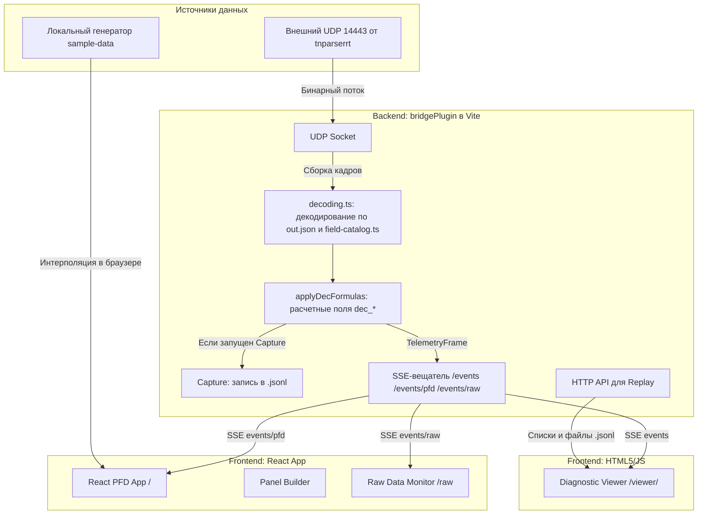

# Анализ проекта Pilot 3D PFD и архитектурные решения для симулятора полета

Этот документ содержит детальный анализ архитектуры проекта, его потоков и форматов данных, а также предлагает варианты проектирования симулятора полета с возможностью управления, записи и воспроизведения.

---

## 1. Анализ текущих потоков данных (Data Flows)

В текущей архитектуре проекта `Pilot_3d_PFD` выделяются три основных контура передачи и обработки данных:



### 1.1. Живой поток (Live UDP Stream)
1. **Приём пакетов**: В модуле `bridge-plugin.ts` открывается UDP-сокет (по умолчанию на порту `14443`).
2. **Сборка кадров**: Если пакет начинается с синхромаркера `0x544e` ("TN"), он интерпретируется как маркерный пакет мультипакетного кадра. Последующие пакеты накопливаются в буфере до достижения размера, указанного в заголовке маркера. Одиночные мелкие пакеты декодируются сразу.
3. **Декодирование**:
   - При запуске Vite строится схема декодирования (`buildDecodeSchema`). Для этого загружается раскладка `out.json` (определяет порядок байтов и структуру слотов на данном порту) и сопоставляется со справочником `field-catalog.ts` (источником типов и канонических имен) по меткам ARINC 429 (`param`).
   - Буфер кадра читается последовательно согласно схеме, создавая плоский объект `Record<string, number | null>`.
4. **Расчет полей (Enrichment)**: К полученному кадру применяются формулы из `decoding.ts` (`applyDecFormulas`). Добавляются расчетные поля с префиксом `dec_` (высота в футах, скорость в узлах, перегрузка `dec_G`).
5. **Вещание (SSE)**:
   - Полный кадр `TelemetryFrame` рассылается клиентам, подключенным к SSE-эндпоинту `/events` (для Diagnostic Viewer).
   - Тот же кадр рассылается на эндпоинт `/events/pfd` (для React PFD).
   - Сырые данные и декодированные структуры транслируются на `/events/raw` (для Raw Data Monitor).

### 1.2. Запись телеметрии (Capture)
1. Команда на запись поступает через `POST /api/capture/start` (вызывается из Diagnostic Viewer `/viewer/`).
2. В папке `captures/` создается файл `.jsonl` с именем вида `YYYY-MM-DDTHH-mm-ss-SSS_live.jsonl`.
3. Каждый раз при генерации нового `TelemetryFrame` в методе `publishDecodedFrame()` данные сериализуются в строку JSON и дописываются в файл (один кадр = одна строка).
4. Запись прекращается по `POST /api/capture/stop`.

### 1.3. Воспроизведение (Replay)
1. В браузере (Diagnostic Viewer) пользователь выбирает файл записи.
2. Делается запрос `GET /api/recordings/:id/range?limit=50000` для загрузки всей сессии в память клиента.
3. В `viewer/app.js` запускается таймер `setInterval(..., 40)`, который инкрементирует виртуальное время проигрывания `playbackTimeMs`.
4. На каждом тике ищется ближайший по времени кадр из массива в памяти и отображается в интерфейсе.

---

## 2. Анализ форматов данных (Data Formats)

Проект использует два основных формата:

### 2.1. Бинарный формат (UDP Payload)
Формат пакетов от `tnparserrt` зависит от раскладки в `out.json`. Для порта `14443` он состоит из последовательности примитивных типов (`Float` (4B), `Double` (8B), `Short/Int16` (2B), `Byte` (1B) и т.д.), идущих строго друг за другом. Суммарный размер одного кадра составляет 474 байта.

### 2.2. Формат `TelemetryFrame` (JSON)
Это плоский словарь без вложенности. Все ключи соответствуют каноническим английским именам из `field-catalog.ts` с добавлением расчетных полей:
```typescript
type TelemetryFrame = {
  schema: "telemetry-frame.v1";
  seq: number;                  // Номер кадра
  timeMs: number;               // Время с начала сессии в мс
  replayTimeMs: number | null;  // Время при воспроизведении (в live-режиме = null)
  receivedAt: string;           // ISO timestamp получения сервером
  source: string;               // Идентификатор источника, например "tnparser-udp-14443"
  
  // Параметры самолета (из field-catalog.ts)
  RadioAltitude: number | null;
  MagneticHeading: number | null;
  RollAngle: number | null;
  PitchAngle: number | null;
  NormalG: number | null;
  CAS: number | null;
  Vy: number | null;
  
  // Расчетные параметры
  dec_BaroAltFt: number | null;
  dec_RadioAltFt: number | null;
  dec_MachKnots: number | null;
  dec_G: number | null;

  // Органы управления
  FCU_Roll_Left: number | null;
  FCU_Pitch_Left: number | null;
  FCU_Roll_Right: number | null;
  FCU_Pitch_Right: number | null;
  FlapsLever: number | null;
  // ...остальные 120+ полей
};
```

---

## 3. Варианты интеграции симулятора полета

Задача состоит в добавлении математической модели полета самолета, возможности интерактивного управления, записи и воспроизведения параметров при сохранении текущих потоков данных.

Ниже приведены три архитектурных варианта реализации:

### Вариант А: Серверный симулятор (Backend-integrated) — *Рекомендуемый*
Симулятор встраивается непосредственно в `bridge-plugin.ts` (Vite dev-server).
- **Как это работает**:
  - На сервере запускается таймер (физический шаг симуляции с частотой 25-50 Гц).
  - При отсутствии реального UDP-потока (или в специальном режиме `"simulation"`) сервер рассчитывает уравнения движения самолета.
  - Кадры симулятора транслируются через стандартный контур SSE `/events/pfd` и `/events`.
  - Запись симулированного полета идет через существующий встроенный `Capture` механизм сервера.
  - Управление самолетом передается с клиента на сервер через REST API (например, `POST /api/simulator/control` с параметрами отклонения ручки управления и тяги) или легковесный WebSocket.
- **Плюсы**:
  - Полностью сохраняются потоки данных: React PFD и Diagnostic Viewer получают данные точно так же, как если бы они шли от реального самолета.
  - Запись полета выполняется на сервере штатными средствами, не требуя отправки больших JSON-файлов с клиента обратно на сервер.
  - Легко переключаться между реальным UDP и симулятором на лету.
- **Минусы**:
  - Требуется реализовать API для отправки управляющих воздействий с фронтенда на бэкенд. Минимальный сетевой лаг (около 5-15 мс) для локального сервера Vite не будет заметен пользователю.

### Вариант Б: Внешний симулятор-эмулятор (UDP Emulator)
Симулятор пишется как отдельный Node.js скрипт (например, `simulator.ts`), запускаемый параллельно с Vite.
- **Как это работает**:
  - Скрипт рассчитывает физику самолета.
  - Скрипт упаковывает полученные данные в бинарный буфер согласно структуре `out.json` для порта `14443`.
  - Отправляет бинарные пакеты на `127.0.0.1:14443` через UDP-сокет.
  - Для управления создается простой оверлей в веб-интерфейсе, отправляющий команды эмулятору.
- **Плюсы**:
  - Абсолютная прозрачность для проекта: Vite bridge-plugin и веб-приложение вообще не знают, что данные искусственные. Потоки данных сохранены на 100%.
- **Минусы**:
  - Избыточная сложность: кодирование 132 параметров в бинарный буфер с учетом специфических типов, коэффициентов и сдвигов битов в `out.json` требует написания большого объема хрупкого кода упаковки (сериализации). При малейшем изменении `out.json` упаковщик сломается.

### Вариант В: Клиентский симулятор (Frontend-only)
Математическая модель полета работает целиком на клиенте в браузере.
- **Как это работает**:
  - В React-приложении добавляется режим `Simulation`.
  - Цикл анимации (`requestAnimationFrame`) рассчитывает физику полета на основе клавиатуры/мыши.
  - Данные напрямую передаются в компонент `<PFD />`.
- **Плюсы**:
  - Нулевая задержка управления (input lag).
  - Простота реализации физики в коде React/JS.
- **Минусы**:
  - **Нарушает потоки данных**: данные симулятора не идут через бэкенд, Raw Monitor и Diagnostic Viewer не будут видеть симуляцию в реальном времени.
  - Сложность записи: чтобы сохранить полет, клиенту придется собирать кадры в своей памяти, а затем отправлять на сервер массив данных через специальный API-метод для записи файла.

### Сравнение вариантов

| Критерий | Вариант А (Серверный) | Вариант Б (Внешний UDP) | Вариант В (Клиентский) |
|---|---|---|---|
| **Сохранение потоков данных** | **Отлично** (идут через SSE) | **Идеально** (идут через UDP и SSE) | **Плохо** (в обход бэкенда) |
| **Сложность разработки** | Средняя (API управления) | Высокая (бинарный упаковщик) | Низкая |
| **Задержка управления (Lag)** | Низкая (~5-15 мс) | Средняя (~10-25 мс) | Нулевая (0 мс) |
| **Интеграция с Capture** | Из коробки (бэкенд пишет в файл) | Из коробки (бэкенд пишет в файл) | Требует отдельного API выгрузки |
| **Устойчивость к изменениям out.json** | Высокая (нет бинарной сборки) | Низкая (сломается при сдвиге слотов) | Высокая |

---

## 4. Проектирование физической модели и управления

Для симулятора необходима упрощенная, но реалистичная математическая модель динамики полета (Flight Dynamics Model, FDM).

### 4.1. Физическая модель полета (Примерный алгоритм)
Модель должна оперировать следующими внутренними переменными состояния:
- Скорость (`V` / `CAS`)
- Углы ориентации (`pitch`, `roll`, `heading`)
- Высота (`altitude`)
- Вертикальная скорость (`Vy`)
- Угол атаки (`AoA`)
- Положение органов управления (отклонение рулей и тяга двигателя)

**Уравнения шага симуляции (dt):**
1. **Тяга и Скорость**:
   $$\text{Thrust} = \text{Throttle} \times T_{max}$$
   $$\text{Drag} = C_d \times V^2$$
   $$a_x = \frac{\text{Thrust} - \text{Drag}}{m} - g \cdot \sin(\text{pitch})$$
   $$V = V + a_x \cdot dt$$
2. **Подъемная сила и вертикальная скорость**:
   $$\text{AoA} = \text{pitch} - \text{flight\_path\_angle}$$
   $$\text{Lift} = C_l \cdot \text{AoA} \cdot V^2$$
   $$a_y = \frac{\text{Lift}}{m} - g \cdot \cos(\text{pitch}) \cdot \cos(\text{roll})$$
   $$\text{Vy} = \text{Vy} + a_y \cdot dt$$
   $$\text{altitude} = \text{altitude} + \text{Vy} \cdot dt$$
3. **Углы крена, тангажа и курса**:
   $$\frac{d(\text{pitch})}{dt} = q \propto \text{Elevator}$$
   $$\frac{d(\text{roll})}{dt} = p \propto \text{Aileron}$$
   $$\frac{d(\text{heading})}{dt} = r \propto \frac{g \cdot \sin(\text{roll})}{V} \text{ (координированный разворот) } + \text{Rudder}$$

### 4.2. Органы управления
Для взаимодействия с симулятором во фронтенде целесообразно добавить обработчики:
1. **Клавиатура (WASD / Стрелки)**:
   - `W` / `S` (или `ArrowUp` / `ArrowDown`) — Управление тангажом (руль высоты / Elevator)
   - `A` / `D` (или `ArrowLeft` / `ArrowRight`) — Управление креном (элероны / Ailerons)
   - `Q` / `E` — Управление рысканием (руль направления / Rudder)
   - `Shift` / `Control` — Увеличение / уменьшение тяги двигателей (Throttle)
2. **Мышь**: виртуальный штурвал (Drag mouse на PFD отклоняет рули пропорционально смещению от центра).
3. **Gamepad API**: Поддержка подключения стандартного USB-джойстика/геймпада напрямую в браузере.

### 4.3. Связь органов управления с TelemetryFrame
Для полной аутентичности потока данных симулятор должен не только менять параметры полета (`PitchAngle`, `CAS`), но и записывать текущие отклонения органов управления в соответствующие поля кадра:
- Отклонение ручки по крену -> `FCU_Roll_Left` (и/или `FCU_Roll_Right`)
- Отклонение ручки по тангажу -> `FCU_Pitch_Left` (и/или `FCU_Pitch_Right`)
- Положение РУД (рычагов управления двигателем) -> `Engine_N1_Target_Left`, `Engine_N1_Target_Right`
- Текущие обороты двигателей -> `Engine_N1_Left`, `Engine_N1_Right` (сглаженно следуют за РУД)
- Команда на закрылки -> `FlapsLever`, текущее положение -> `FlapsPosition`

---

## 5. Запись и воспроизведение полетов симулятора

При выборе **Варианта А (Серверный симулятор)** механизмы записи и воспроизведения работают следующим образом:

1. **Запись**:
   - Пользователь переводит систему в режим симулятора и нажимает кнопку **«Start Capture»** (кнопку можно вынести прямо в интерфейс PFD).
   - Бэкенд начинает рассчитывать физику и одновременно с этим пишет каждый сгенерированный кадр `TelemetryFrame` в `.jsonl` файл в папку `captures/`.
   - По нажатию **«Stop Capture»** запись завершается.
2. **Воспроизведение**:
   - Все записанные полеты симулятора автоматически появляются в списке записей Diagnostic Viewer (`/viewer/`), так как они лежат в той же папке `captures/`.
   - Пользователь загружает запись, и она воспроизводится на PFD стандартным образом через API кадров или локальный плеер в браузере.
   - *Дополнительно*: можно встроить удобный контроллер плеера (Play, Pause, Timeline) непосредственно на страницу PFD, чтобы пользователю не приходилось переходить в `/viewer/` для воспроизведения.

---

## 6. Предлагаемый план реализации (после утверждения)

Если концепция будет одобрена, работу можно разбить на следующие этапы:

1. **Создание физического движка (FDM)**:
   - Разработка класса `FlightSimulator` на TypeScript (с шагом интеграции `step(dt, controls)`).
2. **Встраивание в Vite Bridge**:
   - Интеграция класса `FlightSimulator` в `bridge-plugin.ts`.
   - Создание эндпоинта `POST /api/simulator/control` для приема управляющих сигналов.
   - Добавление логики переключения источника: при переходе в режим симуляции бэкенд останавливает чтение UDP-сокета (или игнорирует его) и начинает генерировать кадры из физического движка.
3. **Разработка интерфейса управления на клиенте**:
   - Добавление панели управления симулятором в React-приложении (выбор режима: UDP / Simulation / Replay).
   - Захват событий клавиатуры/мыши/геймпада во фронтенде и отправка их на сервер с частотой 20-30 Гц.
4. **Интеграция Replay в PFD**:
   - Добавление контрольной панели плеера (шкала времени, кнопки воспроизведения) непосредственно на страницу PFD для удобного проигрывания записанных `.jsonl` треков без перехода в Diagnostic Viewer.
