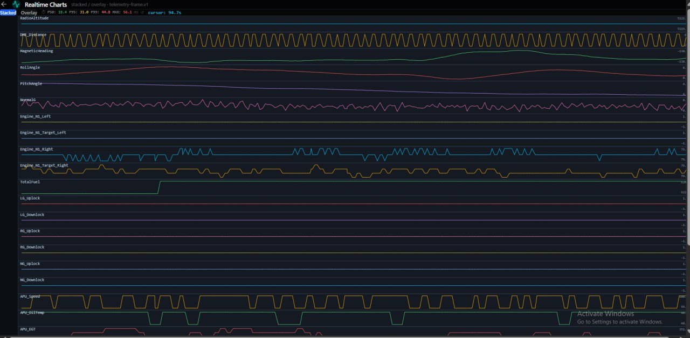

# README_chart_sol_2 — Измеритель производительности графиков

Дата: 2026-06-04

---

## Обзор

Страница Realtime Charts теперь имеет собственный измеритель **end-to-end display latency** — от получения UDP-пакета в bridge до пикселя на Canvas 2D. Индикатор встроен в тулбар и обновляется каждые 500ms.



---

## Архитектура измерения

```
UDP datagram → bridge-plugin.ts (Node.js)
  T₀: Date.now() при socket.on('message')        → frame._t0_ms
  sendPfdSse("pfd-frame", { ...frame, _t0_ms })
     │
     ▼ SSE
  App.tsx → setFrame(data)
     │
     ▼ props
  ChartsView
     │  useEffect: извлекает frame._t0_ms → lastT0MsRef.current
     │  hub.ingest(frame, epochMs)
     │
     ▼
  ChartsPanel (rAF loop)
     │  render():
     │    if dataChanged:
     │      draw to canvas (back-buffer или overlay)
     │      T₁ = performance.timeOrigin + performance.now()
     │      addChartSample(T₁ - lastT0MsRef.current)
     │
     ▼
  chart-latency.ts
     Кольцевой буфер (1000 сэмплов display_ms)
     getChartStats() → P50, P95, P99, MAX
     │
     ▼ setInterval 500ms
  Индикатор в тулбаре ChartsView
```

### Временные метки

| Точка | Где | Метка |
|-------|-----|-------|
| T₀ | `bridge-plugin.ts` — UDP read | `Date.now()` → `_t0_ms` |
| T₁ | `ChartsPanel.render()` — после отрисовки canvas | `performance.timeOrigin + performance.now()` |
| display_ms | = T₁ − T₀ | Единая метрика |

---

## Файлы

### `core/chart-latency.ts` — модуль замера

```typescript
// Кольцевой буфер 1000 сэмплов
addChartSample(displayMs: number)   // добавить замер
getChartStats()                     // { count, p50, p95, p99, max }
resetChartLatency()                 // сброс
```

- **Лёгкий:** только одна метрика (`display_ms`), без `processing_ms`/`frame_id`
- **Кольцевой буфер:** перезапись старых сэмплов при переполнении
- **Перцентили:** стандартная формула nearest-rank (как в `LatencyMonitor`)

### `components/charts-panel.tsx` — запись T₁

Новый проп `lastT0MsRef`:

```typescript
interface ChartsPanelProps {
  // ... существующие пропы
  lastT0MsRef?: React.MutableRefObject<number>;
}
```

В `render()` после блока `if (dataChanged)`:

```typescript
if (lastT0MsRef && lastT0MsRef.current > 0) {
  const tPaint = performance.timeOrigin + performance.now();
  addChartSample(tPaint - lastT0MsRef.current);
}
```

**Почему внутри `dataChanged`:** замер записывается только при фактической отрисовке новых данных на canvas. Курсорные перерисовки (без новых данных) не учитываются.

### `views/charts-view.tsx` — проброс T₀ и индикатор

1. **Извлечение `_t0_ms`** из frame в `useEffect`:

```typescript
useEffect(() => {
  hubRef.current.ingest(frame, epochMs);
  const t0 = frame._t0_ms;
  if (typeof t0 === 'number' && t0 > 0) {
    lastT0MsRef.current = t0;
  }
}, [frame, epochMs]);
```

2. **Индикатор в тулбаре** (справа от кнопок Stacked/Overlay):

```
⏱ P50:12.3 P95:28.7 P99:45.1 MAX:67.2 ms ↺
```

Цвета:
- **P50** → `#48bb78` (зелёный) — типичная задержка
- **P95** → `#ecc94b` (жёлтый) — хвост распределения
- **P99** / **MAX** → `#fc8181` / `#f56565` (красный) — выбросы
- **↺** — кнопка сброса статистики

3. **Poller 500ms** — обновляет состояние без блокировки рендера:

```typescript
useEffect(() => {
  const t = setInterval(() => setLatStats(getChartStats()), 500);
  return () => clearInterval(t);
}, []);
```

---

## Отличия от основного `LatencyMonitor`

| Характеристика | LatencyMonitor (PFD) | ChartLatency (графики) |
|----------------|---------------------|----------------------|
| Т₁ (paint) | rAF в App.tsx после `setFrame` | rAF в ChartsPanel после canvas draw |
| Что меряет | React DOM render | Canvas 2D render |
| Метрики | display_ms, processing_ms, frame_id | Только display_ms |
| Буфер | 5000 сэмплов | 1000 сэмплов |
| Отображение | Фиксированный overlay слева-снизу | Встроен в тулбар |
| CSV экспорт | Да | Нет |
| Видимость | На всех страницах PFD | Только на странице графиков |

---

## Ожидаемые значения

При нормальной работе (sample-данные, 30 fps):

| Метрика | Ожидание | Примечание |
|---------|----------|------------|
| P50 | 10-25ms | Типичная задержка canvas-отрисовки |
| P95 | 30-60ms | Умеренный хвост |
| P99 | 50-100ms | Редкие выбросы (GC, browser scheduling) |
| MAX | до 200ms | Первый кадр или возврат из скрытой вкладки |

**Важно:** измерения не проводятся на скрытой вкладке — rAF заморожен, сэмплы не записываются (visibility guard в ChartsPanel).

---

## Диагностика

Если индикатор не появляется:
1. Проверить, что `frame._t0_ms` присутствует в данных:
   ```
   curl -s http://localhost:3410/api/pfd/current | grep "_t0_ms"
   ```
2. Если `_t0_ms` нет — bridge не перезапущен после добавления полей. Перезапустить `npm run dev`.
3. Если `_t0_ms` есть, но индикатор не показывает значения — проверить консоль браузера на ошибки импорта `chart-latency.js`.

---

## Подёргивание (jitter) — анализ и решение

### Проблема

Latency-метрика показывает отличные цифры (P50 ~16ms), но визуально график подёргивается — «залипание → рывок → залипание → рывок».

### Причина

**Рассинхрон между sliding window и revision gate.**

```mermaid
Кадр 1: данные пришли → dataChanged=true → отрисовка → линии на своих местах ✓
Кадр 2: данных нет  → dataChanged=false → gate блокирует → окно ушло вперёд,
        линии застыли на старых пикселях ✗
Кадр 3: данные пришли → dataChanged=true → отрисовка → линии прыгают в
        новую позицию (окно-то уже ушло)
```

`updateViewRange()` вызывается каждый rAF-кадр (60 fps) — окно скользит плавно. Но revision gate `if (curRevision !== lastRevisionRef)` пропускает кадры без новых данных. При 30 fps sample-данных это означает: каждый второй кадр — пропуск.

### Почему latency-метрика этого не ловит

Замер `addChartSample()` вызывается только внутри `if (dataChanged)`. Кадры-пропуски (где gate заблокировал отрисовку) не попадают в статистику. Метрика измеряет задержку для отрисованных кадров, а не плавность анимации.

### Решение: разделение «дорогой» и «дешёвой» фаз

Идея: дорогую фазу (snapshots + decimation + Y-range) делать только при новых данных. Дешёвую (pixel mapping + draw) — каждый кадр.

**Stacked:**
- `dataChanged` → отрисовать back-buffer (дорого)
- Каждый кадр → **blit back-buffer на canvas** (дёшево: drawImage)
- Точки «скользят» вместе с окном, т.к. back-buffer статичен, а blit каждый кадр

**Overlay:**
- `dataChanged` → `computeOverlaySeries()` (snapshots + decimation + Y-range), сохранить `cachedSeriesList` и `cachedYMin/YMax`
- Каждый кадр → **пересчитать пиксельные координаты** из кэшированных `DisplayPoint[]` с текущим окном + отрисовать
- Без дорогих запросов к DataHub и повторной децимации

### Результат

- Линии движутся плавно (60 fps) независимо от частоты поступления данных
- CPU не растёт: дорогая фаза по-прежнему только на новых данных
- Latency-метрика продолжает работать корректно (замеряется полный цикл с дорогой фазой)

### Реализация

**Stacked** (`charts-panel.tsx`): вынести `ctx.clearRect + ctx.drawImage(bb)` за пределы `if (dataChanged)`.

**Overlay** (`charts-panel.tsx`): добавить `cachedOverlayRef` (`{seriesList, yMin, yMax, viewStartSec, viewEndSec}`). При `dataChanged` — обновить кэш + отрисовать. Без `dataChanged` — пересчитать пиксели из кэша и отрисовать.
